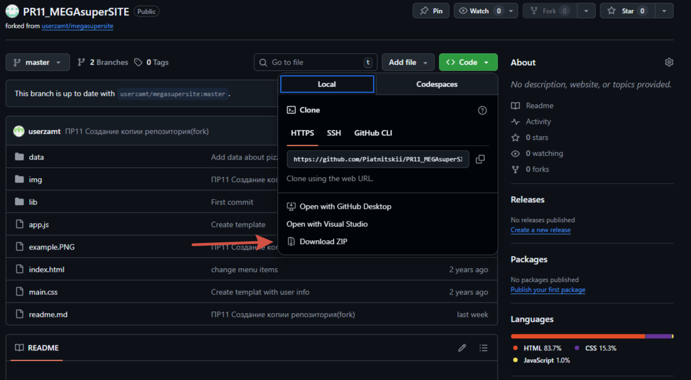

#  PizzaHub - Сайт про пиццы :trollface:  :trollface:  :trollface: 


## 1. **Описание сайта**  

Этот репозиторий хранит в себе разметку простого сайта для продажи пицц.  
**Суть этого сайта** - предоставить пример для получения новый знаний человеку, который только начал изучать языки разметки!  
Сам сайт написан на языке HTML + CSS (и чучуть JavaScript).  

***

 ### Структура сайта

 Сайт собран грамотно, а интуитивно понятный интерфейс позволит быстро разобраться с его структурой и содержимым.
  
Вот как он выглядит:  

  

На фото видно, что сайт состоит из 2 частей:  
* Шапка (header);
* Body (Body);  

**Шапка (header)** содержит меню и логотип сайта.  

**Тело (Body)** сайта представляет собой набор блоков с информацией о товаре: картинка, название, описание.  
Также блок содержит красную кнопку "Заказать"  и в правом нижнем углу ФИО и фотографию повора  

Пример информационного блока товара:  
```HTML
<div class="col-md ss-pizza p-3 m-2 rounded">
    <article>
        <header>Домашняя</header>
        
        <p>Домашняя пицца в духовке с колбасой классическая. Вкусная домашняя пицца с тонким воздушным тестом.</p>
        <button type="button" class="btn btn-outline-danger btn-lg">Заказать</button>
        <footer style="clear: both;" class="pt-1 d-flex flex-row-reverse align-items-center">
            
            <p>Иванов Иван Иванович</p>
        </footer>
    </article>
</div>
```
### Установка проекта

Для установки сайта нажмите на зеленую кнопку "<> Code" и выбирете пункт "Download ZIP", как показано на картинке ниже:  

  

Для работы над проектом вам понадобиться **Специальное ПО** - IDE или редакторы, можно использовать любой из представленных ниже:

| Номе  | Название  | Описание  |
|-------|----------|------------|
| 1     | Visual Studio Code (VS Code)    | Редактор кода для веб-разработки, который завоевал популярность благодаря функциональности и удобству использования. Он поддерживает множество языков программирования, в том числе HTML, CSS, JavaScript, TypeScript и Python. Это OpenSource ПО с высокой производительностью|      
| 2     | IntelliJ IDEA     | IntelliJ IDEA — среда разработки на Java и Kotlin, но поддерживает и другие языки, например, HTML, CSS, JavaScript/
| 3     |  Sublime Text | Текстовый редактор для веб-разработки поддерживает работу с множеством языков программирования и разметкой. Также в нем есть удобные функции для навигации и персонализации рабочего процесса. Он более сложен в освоении, и за часть функций придеться залатить|  


## Как скачать Visual Studio Code
### 1. Скачайте с официального сайта
Самый надёжный способ загрузить Visual Studio Code — с [jфициального сайта](https://visualstudio.microsoft.com/ru/downloads/ "тыкай"):

Оказавшись там:

Нажмите кнопку Скачать.
Выберите свою операционную систему: Windows, macOS или Linux.
Пакет установщика начнёт загружаться автоматически.
### 2. Выберите подходящую версию
Visual Studio Code доступен в нескольких форматах в зависимости от вашей операционной системы:

Windows (установщик для пользователя) — рекомендуется для большинства пользователей.
Windows (установщик системы) — лучше всего подходит для корпоративных или общих компьютеров.
macOS (.zip или .dmg) — выберите в зависимости от предпочтений.
Linux (deb, rpm, tar.gz, snap) — выберите свой дистрибутив и менеджер пакетов.
После загрузки запустите программу установки и следуйте инструкциям.
 


